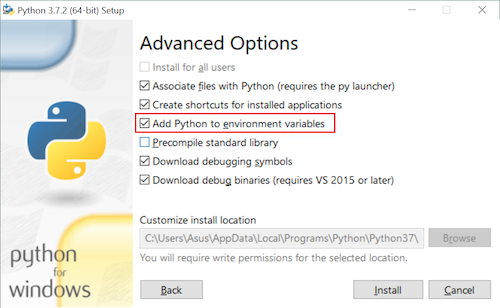

# NSCC IT Setup for Logic and Programming Course (Python)
### Let's get you all setup!
**Sep 2026** 

The following is a checklist of installations / configurations to setup your machine (whether it be in the lab or your home machine) to be ready for the Logic and Programming course.:

1) install git on your computer
    - download git from https://git-scm.com
    - follow the installation instructions, and leave all settings as default
2) create a github account
    - go to https://github.com and create an account
    - be sure to use your personal email address (gmail, etc) and NOT your NSCC email address
    - be sure to remember your username / password
3) install VS Code editor
    - download VS Code from https://code.visualstudio.com
    - follow the installation instructions
    - be sure to checkoff the following checkboxes:
        - *Add 'Open with Code' action to Windows Explorer file context menu*
        - *Add 'Open with Code' action to Windows Explorer directory context menu*
    
4) install the python SDK
    - download python from https://www.python.org
    - follow the installation instructions
    - be sure to checkoff the checkbox that says *Add Python to environment variables*
    
5) install required VS Code extensions
    - open VS Code
    - click on the Extensions icon on the left sidebar (or press `Ctrl+Shift+X`)
    - search for and install the following extensions by clicking the install button for each one:
        - *Live Server* by Ritwick Dey
        - *vscode-icons* by vscode-icons team
        - *python* by Microsoft
6) adjust word wrap setting in VS Code
    - open VS Code
    - click on the gear icon in the bottom-left corner, and select *Settings*
    - in the search bar at the top, type `word wrap`
    - find the setting that says *Editor: Word Wrap* and change the dropdown to `on`
7) create an SSH key to easily authenticate with github for the school year
    - open a terminal window (Command Prompt, PowerShell, or Terminal) to your user account on your computer
        - on a lab machine on campus this folder will be named after your student id number
    - run the following command: 
        ```
        ssh-keygen
        ```
        - click enter on all options until the cursor appears again
    - change directory to the /.ssh folder by running the following command:
        ```
        cd .ssh
        ```
        - two keys have been created in this folder: a private key (id_ed25519) and a public key (id_ed25519.pub)
    - view the contents of the public key file by running the following command:
        ```
        type id_ed25519.pub
        ```
        - the contents of the file is displayed in the terminal window
        - it will be one single line; select it with the mouse and copy it to your clipboard (right-click and select copy, or press `Ctrl+C`)
    - add the public key to your github account
        - go to your github account in a web browser (login if necessary)
        - click on your profile picture in the top-right corner, and select *Settings*
        - in the left sidebar, select *SSH and GPG keys*
        - click the green *New SSH key* button
        - in the *Title* field, enter a name for the key (e.g. LAB308 or Laptop)
        - in the *Key* field, paste the contents of your clipboard (right-click and select paste, or press `Ctrl+V`)
        - click the green *Add SSH key* button
    - test the connection to github by running the following command in your terminal window:
        ```
        ssh -T git@github.com
        ```
        - if this is your first time connecting to github, you will be asked if you want to continue connecting; type `yes` and press enter
        - you should see a message that says "Hi [your username]! You've successfully authenticated, but GitHub does not provide shell access."